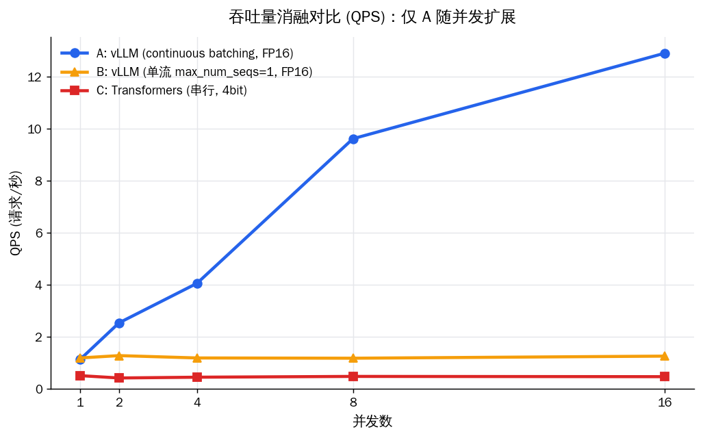
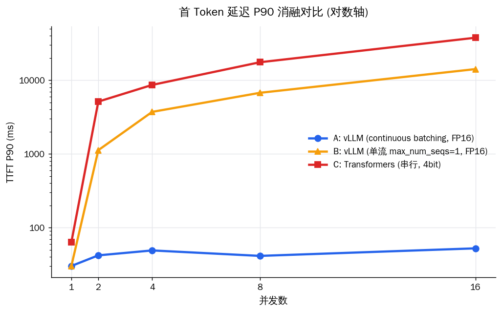
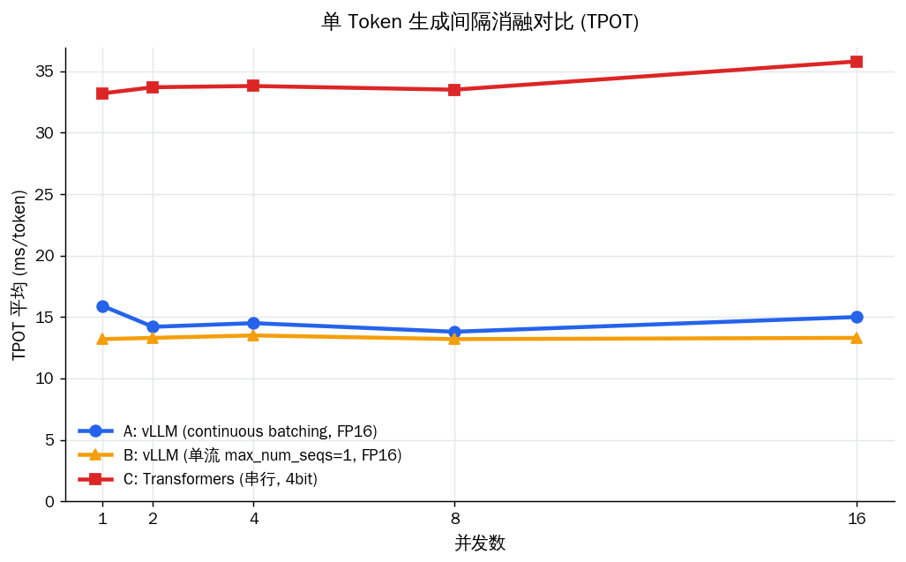

# LLM 高并发推理服务 & 性能压测平台

基于 **vLLM**，将 [电商客服微调模型](https://github.com/Azir111/customer-service-llm)
部署为高并发推理服务，并通过**消融实验**定量拆解 vLLM 的性能来源。

> **核心发现：吞吐能否随并发扩展，取决于有无 continuous batching，而非框架本身。**
> 用 vLLM 自身做对照——仅把 `max_num_seqs` 从 256 改到 1（关掉 batching），
> 其余完全不变——QPS 就从近线性扩展（1.13 → 12.91，约 11×）退化为全程卡死（约 1.2），
> 与朴素 Transformers 一样毫无扩展性。

---

## 核心结果

> RTX 4060Ti (8GB) ｜ Qwen2.5-1.5B-Instruct（SFT LoRA + DPO 合并）｜ 流式压测，每并发级别 50 请求，预热 5 次，max_tokens=256。

### 三组消融设计（变量隔离）

朴素的「vLLM vs 原生 Transformers」对比同时变了两个变量（**有无 batching** + **精度 FP16/4bit**），
其差距无法归因。本项目改用 vLLM 自身做单变量对照，把性能来源拆开：

| 组 | 框架 | batching | 精度 | 作用 |
|------|------|------|------|------|
| **A** | vLLM | 开 (max_num_seqs=256) | FP16 | 完整 vLLM |
| **B** | vLLM | 关 (max_num_seqs=1) | FP16 | 单流对照，**仅去掉 batching** |
| **C** | Transformers | 无（串行） | 4bit | 朴素基线 |

- **A vs B**：唯一变量是 continuous batching（框架 / 精度 / kernel 全同）→ **纯 batching 贡献**。
- **B vs C**：都是单流无批处理，差距 = **kernel 优化 + 量化开销**（已和 batching 分离）。
- **A vs C**：端到端总差距，含全部因素叠加，仅作总览、**不单独归因**。

### 关键指标（并发=16）

| 指标 | A: vLLM (batching) | B: vLLM (单流) | C: Transformers (4bit) |
|------|------|------|------|
| 首 Token 延迟 TTFT_P90 | **52.4 ms** | 14146 ms | 37684 ms |
| 吞吐量 QPS | **12.91** | 1.26 | 0.47 |
| 单 Token 间隔 TPOT | 15.0 ms | 13.3 ms | 35.8 ms |
| 吞吐扩展性（并发 1→16） | 1.13 → 12.91（近线性） | 约 1.2（无扩展） | 约 0.5（无扩展） |

**结论（每条都对应一个被隔离出来的变量）**

1. **扩展性来自 continuous batching（A vs B）**：开启 batching 的 A，QPS 随并发从 1.13 近线性扩展到 12.91（约 11×）；仅去掉 batching 这一个变量退化为单流的 B，QPS 全程卡在约 1.2，并发=16 时 A 是 B 的约 10 倍、TTFT_P90 从 52.4ms 飙到 14.1s。B 与朴素 Transformers（C）一样毫无扩展性——证明吞吐扩展的根本来源是调度机制，不是「换了个框架」。
2. **单 token 速度由 kernel + 精度决定，与 batching 无关（A vs B 的 TPOT）**：A 与 B 的 TPOT 接近（15.0 vs 13.3ms），说明 batching 不影响吐字快慢；而 B（FP16）比 C（4bit）的 TPOT 快约 2.7×，这部分才是 kernel 优化 + 反量化开销的贡献。
3. **端到端总差距（A vs C，TTFT 719× / QPS 27×）仅作总览**：它混合了 batching、kernel、量化三重因素，不可单独归因，故不再作为主打数字。

> 完整明细（各并发级别 TTFT / TPOT / ITL / 成功率 + 全部图表 + 归因分析）见 [消融压测报告](results/benchmark_report_ablation.md)。

---

## 项目定位

| 项目 | 关注点 |
|------|--------|
| [customer-service-llm](https://github.com/Azir111/customer-service-llm) | 模型能力：LoRA 微调 + DPO 对齐 |
| **本项目** | 工程能力：高并发服务化 + 性能评测 + 变量隔离分析 |

> 同一个模型，从"能回答"到"高并发稳定回答"。

---

## 技术路线

\`\`\`
微调模型 (SFT + DPO)
    ↓
        ┌─────────────── vLLM 部署（OpenAI-compatible API）───────────────┐
        A: batching 开 (max_num_seqs=256)   B: batching 关 (max_num_seqs=1)   C: Transformers 4bit
        └──────────────────────────────┬──────────────────────────────────┘
                    asyncio 流式并发压测（aiohttp + SSE）
                                ↓
                TTFT / TPOT / ITL / QPS / 成功率 分析
                                ↓
        三线消融对比图 + Markdown 报告（按变量归因）
\`\`\`

---

## 项目结构

\`\`\`
llm-inference-benchmark/
├── deploy/
│   ├── vllm_server.py          # vLLM 服务启动器（支持 --max-num-seqs / --dtype，用于消融）
│   └── baseline_server.py      # Transformers 原生服务（对照组，支持流式 SSE）
├── benchmark/
│   ├── load_test.py            # 端到端并发压测（非流式）
│   ├── load_test_stream.py     # 流式并发压测（TTFT / TPOT / ITL）★
│   ├── analyze.py              # 端到端结果分析
│   └── analyze_stream.py       # 三组消融分析 + 三线图 + Markdown 报告 ★
├── results/                    # 压测结果输出目录
│   ├── stream_results_A.json   # A 组：vLLM 有 batching
│   ├── stream_results_B.json   # B 组：vLLM 单流
│   ├── stream_results_C.json   # C 组：Transformers 4bit
│   ├── qps_ablation.png
│   ├── ttft_ablation_linear.png
│   ├── ttft_ablation_log.png
│   ├── tpot_ablation.png
│   ├── benchmark_report_ablation.md
│   └── archive/                # 旧版（端到端 / 两线对比）结果，已被消融版取代
├── demo_simulate.py            # 模拟数据演示（无需 GPU）
├── requirements.txt
└── README.md
\`\`\`

---

## 环境

- GPU: NVIDIA RTX 4060Ti (8GB)
- Python: 3.10+
- CUDA: 12.1+

---

## 快速开始

### 1. 安装依赖

\`\`\`bash
pip install -r requirements.txt
\`\`\`

### 2. 启动三组服务（消融实验）

三组共享同一张 GPU，**不能同时开**，逐一启动 → 压测 → 关闭。

\`\`\`bash
# A 组：vLLM，开启 continuous batching
python deploy/vllm_server.py \
    --model ~/projects/output/merged_model \
    --port 8000 --max-num-seqs 256 --dtype float16 \
    --gpu-memory-utilization 0.85 --max-model-len 2048

# B 组：vLLM，强制单流（关掉 batching），其余与 A 完全一致
python deploy/vllm_server.py \
    --model ~/projects/output/merged_model \
    --port 8002 --max-num-seqs 1 --dtype float16 \
    --gpu-memory-utilization 0.85 --max-model-len 2048

# C 组：Transformers 原生基线（4bit）
python deploy/baseline_server.py \
    --model ~/projects/output/merged_model \
    --port 8001
\`\`\`

> 变量隔离要点：A、B 两组 `--dtype` 必须写死成同一个值（都 FP16），唯一区别只有 `--max-num-seqs`。
> `--served-model-name` 默认 `customer-service-llm`，需与压测脚本 `--model` 一致。

### 3. 逐组运行流式压测

每组只压当前在线的那一个后端，输出到不同文件避免覆盖：

\`\`\`bash
# 压 A
python benchmark/load_test_stream.py \
    --vllm-url http://localhost:8000/v1/chat/completions \
    --concurrency 1 2 4 8 16 --requests 50 --warmup 5 \
    --output results/stream_results_A.json

# 压 B（单流高并发排队久，确认 timeout 足够大且三组一致）
python benchmark/load_test_stream.py \
    --vllm-url http://localhost:8002/v1/chat/completions \
    --concurrency 1 2 4 8 16 --requests 50 --warmup 5 \
    --output results/stream_results_B.json

# 压 C
python benchmark/load_test_stream.py \
    --vllm-url http://localhost:8001/v1/chat/completions \
    --concurrency 1 2 4 8 16 --requests 50 --warmup 5 \
    --output results/stream_results_C.json
\`\`\`

### 4. 消融分析

\`\`\`bash
python benchmark/analyze_stream.py \
    --input-a results/stream_results_A.json \
    --input-b results/stream_results_B.json \
    --input-c results/stream_results_C.json \
    --outdir results
# 输出：4 张三线对比图 + results/benchmark_report_ablation.md
\`\`\`

### 无 GPU 演示（模拟数据）

\`\`\`bash
python demo_simulate.py          # 生成模拟压测数据
python benchmark/analyze.py      # 生成报告和图表
\`\`\`

---

## 实验结果（RTX 4060Ti，真实流式压测）

> 模型：Qwen2.5-1.5B-Instruct（SFT LoRA + DPO 合并），每并发级别 50 请求，预热 5 次，max_tokens=256。

### Sanity check：并发=1 时 A≈B

并发=1 时只有一个请求，batching 开不开都没区别。实测 A / B 的 TTFT_P90 为 30.2 / 30.2 ms，QPS 为 1.13 / 1.19——两者重合，验证消融实验没有引入额外变量，后续结论才站得住。

### 吞吐量（QPS）——核心图

| 并发 | A: vLLM QPS | B: 单流 QPS | C: Transformers QPS |
|------|------|------|------|
| 1    | 1.13  | 1.19 | 0.51 |
| 2    | 2.54  | 1.28 | 0.42 |
| 4    | 4.06  | 1.19 | 0.45 |
| 8    | 9.62  | 1.18 | 0.48 |
| 16   | **12.91** | 1.26 | 0.47 |

只有 A（开 batching）随并发近线性爬升；B 和 C 都贴地平走。**A 与 B 唯一的差别就是 `max_num_seqs`**，并发=16 时 A 的吞吐约为 B 的 10 倍——这条扩展性差距可以 100% 归因于 continuous batching。

### 首 Token 延迟（TTFT_P90）

| 并发 | A: vLLM | B: 单流 | C: Transformers |
|------|------|------|------|
| 1    | 30.2 ms  | 30.2 ms   | 63.5 ms |
| 2    | 42.1 ms  | 1124 ms   | 5123 ms |
| 4    | 49.1 ms  | 3719 ms   | 8631 ms |
| 8    | 41.4 ms  | 6745 ms   | 17523 ms |
| 16   | **52.4 ms** | **14146 ms** | **37684 ms** |

A 全程平稳（30→52ms）。B 一旦关掉 batching，TTFT 立刻随并发飙升——请求开始排队，排队时间全计入首 token 延迟，这正是 continuous batching 消除的部分。

### 单 Token 生成间隔（TPOT）

| 组 | TPOT_mean（并发 1→16） |
|------|------|
| A: vLLM (batching, FP16) | 15.9 → 15.0 ms |
| B: vLLM (单流, FP16)     | 13.2 → 13.3 ms |
| C: Transformers (4bit)   | 33.2 → 35.8 ms |

三组各自都基本不随并发变化。关键看点：**A 与 B 的 TPOT 接近**（13–16ms，都是 vLLM FP16），证明 **batching 几乎不影响单 token 速度**；而 B（FP16）比 C（4bit）快约 2.7×，这才是 kernel + 量化的贡献。

> ⚠️ 归因修正：单 token 速度（TPOT）由 **kernel 实现与计算精度**决定，**与 PagedAttention 无关**。
> PagedAttention 解决的是 KV cache 显存碎片、提升并发上限，影响的是**吞吐**而非单 token 延迟。
> （早期版本曾把 TPOT 优势误归因于 PagedAttention，本轮消融数据予以纠正。）

### 流式稳定性（ITL_P99）

C 组（4bit 串行）的 ITL_P99 高达 124–140ms，远高于其 TPOT 均值（约 34ms），说明存在明显的**偶发吐字卡顿**；
而 A、B 两组（vLLM）的 ITL_P99 都在几十 ms 以内，远低于 C，与各自 TPOT 大体贴合。vLLM 不只是更快，流式输出也更稳。

### 核心结论

**1. 扩展性来自 continuous batching（A vs B）**：仅改 `max_num_seqs` 一个参数，并发=16 时 QPS 相差约 10×、TTFT_P90 相差约 270×。串行架构下第 N 个请求必须排队等前面所有请求整段生成完；Continuous Batching 让新请求在下个 decode step 即可入批，几乎零排队。

**2. 单 token 速度与 batching 无关（A vs B 的 TPOT）**：A、B 的 TPOT 接近（13–16ms），batching 几乎不带来单 token 边际成本；B 对 C 的 TPOT 优势（2.7×）来自 vLLM 的 fused kernel + 对照组 4bit 的反量化开销，两者叠加、未进一步隔离。

**3. 端到端总差距不作主打（A vs C）**：A 对 C 的 TTFT/QPS 差距同时含 batching、kernel、量化，不可单独归因，仅作总览。

**4. 关于成功率与超时阈值**：三组成功率均 100%（超时阈值高于最慢请求）。但衡量高并发服务质量应看 TTFT/SLA，而非请求完成率——并发=16 时 B/C 尾部请求要等十几到三十秒才出首字，对客服等实时场景已等同不可用。

---

## 关键技术点

### 为什么 continuous batching 能让吞吐随并发扩展？

\`\`\`
单流 / Static Batching（B 组、C 组）：
请求1 ████████████████ 完成
请求2 等待...等待...████████████████ 完成
请求3                 等待...████████████████ 完成
任意时刻只有约 1 个请求在 GPU 上，吞吐恒等于单请求速度

vLLM Continuous Batching（A 组）：
Step1: [req1, req2, req3, req4]  ← 每步 decode 动态加入新请求
Step2: [req1, req2, req5, req6]  ← req3/req4 完成即释放位置
GPU 利用率接近 100%，吞吐随并发近线性扩展
\`\`\`

本项目的 A vs B 消融正是这张图的实测证据：B（单流）QPS 恒为约 1.2，A（batching）爬到 12.91。

### PagedAttention 的作用边界（容易混淆的点）

- 传统 KV cache：按最大长度预分配连续显存，碎片率高
- PagedAttention：分页管理（类似 OS 虚拟内存），碎片率极低，同等 8GB 显存能塞下更多并发
- **作用边界**：PagedAttention 提升的是「能同时跑多少请求」（并发上限 / 吞吐），**不是单 token 的 decode 速度**。本项目 TPOT 数据已证明单 token 速度由 kernel + 精度决定。

### 为什么选 OpenAI-compatible API？

- 接口标准化：压测脚本、客户端代码无需改动即可切换后端（A/B/C 三组共用一套压测脚本正得益于此）
- 生产就绪：直接对接现有业务系统（调用方只需改 base_url）
- 监控友好：与 LangChain、LiteLLM 等生态无缝集成

---

## 压测方法论

### 为什么用 asyncio + aiohttp？

\`\`\`python
# 错误做法：用 threading 或同步请求，受 GIL 限制，并发数不准确
# 正确做法：asyncio + Semaphore 精确控制在途请求数
semaphore = asyncio.Semaphore(concurrency)
async with semaphore:
    await session.post(url, json=payload)
\`\`\`

### 为什么测流式（SSE）而非只测端到端延迟？

真实 LLM 服务几乎都是流式输出。只测端到端延迟会被输出长度污染（500 token 的回答 vs 50 token 的回答无法直接比较），而 continuous batching 的优势恰恰体现在高并发下 TTFT 不爆炸——必须流式才测得到。压测脚本逐 token 记录到达时间戳，从而拆分出 TTFT 与 TPOT 两个可分别优化的维度。

### 为什么要做消融而不是直接对比 vLLM vs Transformers？

直接对比同时变了「有无 batching」和「FP16 vs 4bit」两个变量，得到的差距无法归因——你说不清快是因为调度还是因为精度。引入 B 组（vLLM 单流 FP16）后，A vs B 锁死了除 batching 外的所有变量，才能干净地把"扩展性来自 batching"这一结论证出来。这也是本项目相比朴素 benchmark 的核心方法论改进。

### 关键指标说明

| 指标 | 说明 | 意义 |
|------|------|------|
| TTFT | Time To First Token，首 Token 延迟 | 响应快不快（受 prefill + 排队影响） |
| TPOT | Time Per Output Token，每输出 Token 平均间隔 | 吐字流不流畅（受 kernel + 精度影响） |
| ITL  | Inter-Token Latency，相邻 Token 到达间隔 | 流式输出有无偶发卡顿 |
| P50 / P90 / P99 | 中位 / 90% / 99% 分位延迟 | 典型 / 大多数 / 长尾体验 |
| QPS | Queries Per Second | 系统吞吐能力 |
| Token/s | 总 Token 生成速率 | GPU 计算利用率 |

---

## 问题

**Q: vLLM 的 Continuous Batching 和普通 Batching 有什么区别？**

A: 普通 Static Batching 需要凑齐一批请求才能推理，先到的必须等后到的，GPU 空闲等待；Continuous Batching 在每个 decode step 都能动态加入新请求、释放已完成的请求，GPU 始终满载，高并发下吞吐接近线性扩展。本项目用 `max_num_seqs=1` 关掉它做对照，QPS 直接从 12.91 跌回约 1.2，定量验证了这一点。

**Q: TTFT 和 TPOT 为什么要分开测？**

A: 两者优化方向不同。TTFT 主要受 prefill 计算量和排队影响（Continuous Batching、Chunked Prefill 优化它）；TPOT 受单步 decode 速度影响（量化、kernel、显存带宽优化它）。本项目消融数据印证了这种正交性：去掉 batching 后 TTFT 暴涨但 TPOT 几乎不动，说明 batching 只作用于排队/吞吐维度，不碰单 token 速度。

**Q: 为什么对照组 C 用了 4bit，会不会让对比不公平？**

A: 会——这正是引入 B 组的原因。C（Transformers 4bit）相比 A 同时差在 batching 和精度两处，无法归因。B 组（vLLM 单流 FP16）把精度对齐到和 A 一样，唯一变量只剩 batching，从而把"扩展性"和"kernel/量化"两类贡献彻底分开。C 仅作为「真实朴素部署」的参照保留。

**Q: 为什么不直接用 4bit 量化的 vLLM？**

A: RTX 4060Ti 8GB 显存，Qwen2.5-1.5B FP16 约需 3GB，vLLM 留出 KV cache 空间后可以跑。若换更大模型（7B FP16 约需 14GB），再考虑 AWQ/GPTQ 量化。量化会有精度损失，需要在延迟、显存和精度之间权衡。

**Q: 实际生产中 vLLM 还有哪些优化手段？**

A: ① Tensor Parallelism 多卡并行；② Prefix Caching 复用相同 system prompt 的 KV cache；③ Speculative Decoding 草稿模型加速；④ 配合 NGINX 负载均衡做多实例水平扩展。

---

> 此外还做了多实例负载均衡的初步探索（NGINX round_robin vs least_conn，
> 单卡双实例模拟），属方法论演示，详见 [docs/load_balancing.md](docs/load_balancing.md)。

---

## 后续工作（Roadmap）

- **输出质量评测**：加小规模评测集 + LLM-as-judge，验证部署/量化后回答质量未退化，把"延迟"故事升级为"延迟 × 质量"权衡。
- **vLLM 参数调优表**：系统扫 `max_num_seqs` / `max_num_batched_tokens` / `enable_chunked_prefill` / `enable_prefix_caching`，输出「参数 → TTFT/QPS/显存」影响表。
- **真实 GPU 利用率测量**：压测时用 nvidia-smi / DCGM 采样利用率与显存，把"GPU 接近 100%"从断言变测量。
- **统计严谨性**：每并发级别加到 100+ 请求、多轮重复、报方差 / 置信区间（尤其负载均衡一节）。
- **容器化 + 可观测性**：Dockerfile / docker-compose，vLLM `/metrics` 接 Prometheus + Grafana。
- **多卡张量并行（TP）与真实多实例负载均衡**。