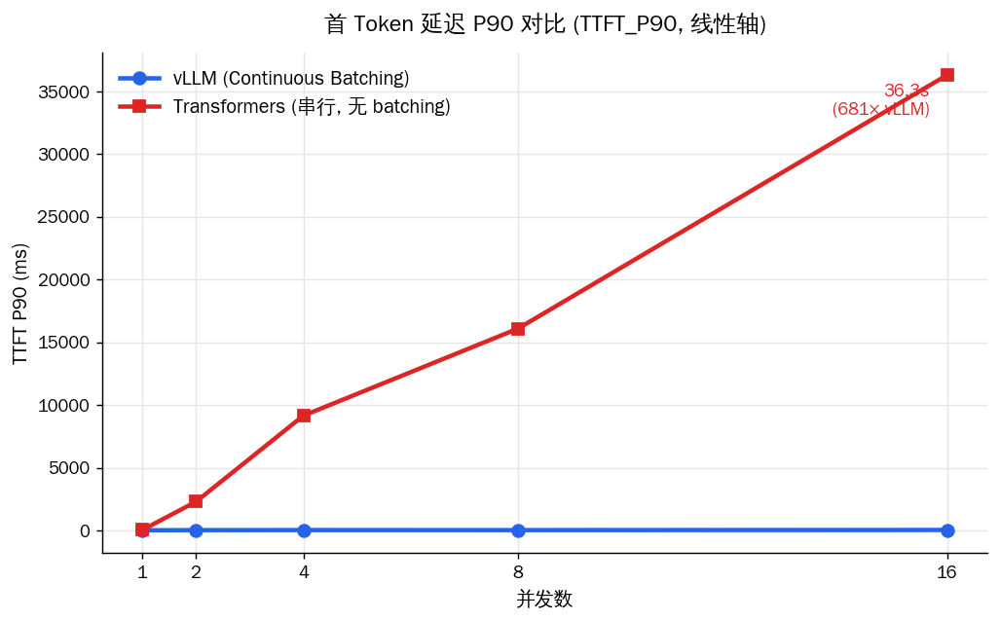
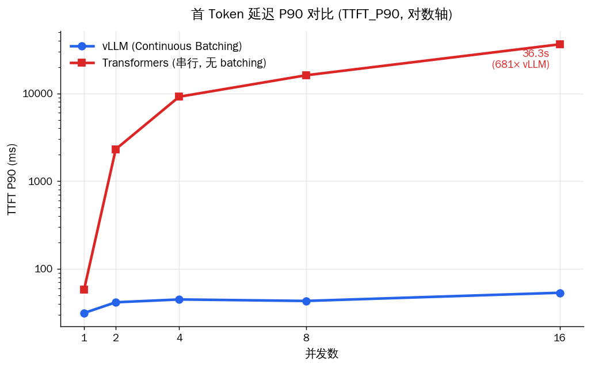

# LLM 高并发推理服务 & 性能压测平台

基于 **vLLM**，将 [电商客服微调模型](https://github.com/Azir111/customer-service-llm)
部署为高并发推理服务，并与 Transformers 原生推理做量化对比。

> **vLLM 在 16 并发下首 Token 延迟（TTFT_P90）仅 53ms，原生 Transformers 推理需 36 秒，相差 681 倍。**



---

## 核心结果

> RTX 4060Ti (8GB) ｜ Qwen2.5-1.5B-Instruct（SFT LoRA + DPO 合并）｜ 流式压测，每并发级别 50 请求，预热 5 次。

| 指标（并发=16） | vLLM | 原生 Transformers | 差距 |
|------|------|------|------|
| 首 Token 延迟 TTFT_P90 | 53 ms | 36310 ms | **681×** |
| 吞吐量 QPS | 12.18 | 0.44 | **28×** |
| 单 Token 间隔 TPOT | 13.5 ms | 31.5 ms | 2.3× |
| 吞吐扩展性（并发 1→16） | 1.26 → 12.18（近线性） | 0.52 → 0.44（无扩展） | — |

**结论**

1. **TTFT 差距随并发指数级拉大**：串行架构下，第 N 个请求必须排队等前面所有请求**整段**生成完，排队时间全部计入首 Token 延迟；vLLM 的 Continuous Batching 让新请求在下一个 decode step 即可加入当前批次，几乎无需排队。
2. **QPS 近线性扩展 vs 完全卡死**：vLLM 加并发吞吐线性增长，原生推理全程 ~0.5 QPS，加并发零收益——串行架构下系统吞吐恒等于单请求速度。
3. **TPOT 两边各自恒定，vLLM 始终快 2.3 倍**：印证 Continuous Batching 让并发几乎没有单 Token 的边际成本。

> 完整明细（各并发级别 TTFT / TPOT / ITL / 成功率 + 全部图表）见 [流式压测报告](results/benchmark_report_stream.md)。

---

## 项目定位

| 项目 | 关注点 |
|------|--------|
| [customer-service-llm](https://github.com/Azir111/customer-service-llm) | 模型能力：LoRA 微调 + DPO 对齐 |
| **本项目** | 工程能力：高并发服务化 + 性能评测 |

> 同一个模型，从"能回答"到"高并发稳定回答"。

---

## 技术路线

```
微调模型 (SFT + DPO)
    ↓
vLLM 部署（OpenAI-compatible API）   Transformers 原生部署（对照组）
    ↓                                      ↓
        asyncio 流式并发压测（aiohttp + SSE）
                    ↓
        TTFT / TPOT / ITL / QPS / 成功率 分析
                    ↓
             Markdown 对比报告 + 可视化图表
```

---

## 项目结构

```
llm-inference-benchmark/
├── deploy/
│   ├── vllm_server.py          # vLLM 服务启动器（OpenAI-compatible API）
│   └── baseline_server.py      # Transformers 原生服务（对照组，支持流式 SSE）
├── benchmark/
│   ├── load_test.py            # 端到端并发压测（非流式）
│   ├── load_test_stream.py     # 流式并发压测（TTFT / TPOT / ITL）★
│   ├── analyze.py              # 端到端结果分析
│   └── analyze_stream.py       # 流式结果分析 + 图表 + Markdown 报告 ★
├── results/                    # 压测结果输出目录
│   ├── stream_results.json     # 流式压测原始数据
│   ├── ttft_comparison_linear.png
│   ├── ttft_comparison_log.png
│   ├── qps_comparison.png
│   ├── tpot_comparison.png
│   └── benchmark_report_stream.md
├── demo_simulate.py            # 模拟数据演示（无需 GPU）
├── requirements.txt
└── README.md
```

---

## 环境

- GPU: NVIDIA RTX 4060Ti (8GB)
- Python: 3.10+
- CUDA: 12.1+

---

## 快速开始

### 1. 安装依赖

```bash
pip install -r requirements.txt
```

### 2. 启动 vLLM 服务

```bash
# 部署微调后的模型（替换为你的模型绝对路径）
python deploy/vllm_server.py \
    --model /path/to/merged_model \
    --port 8000 \
    --gpu-memory-utilization 0.85 \
    --max-model-len 2048

# 或直接用 vllm cli
vllm serve /path/to/merged_model \
    --port 8000 \
    --served-model-name customer-service-llm \
    --max-model-len 2048
```

> 注意：`--served-model-name` 需与压测脚本的 `--model` 参数一致（默认 `customer-service-llm`），否则请求会被拒绝。

### 3. 启动 Transformers 基线服务（对照组）

```bash
# 新开一个终端
python deploy/baseline_server.py \
    --model /path/to/merged_model \
    --port 8001
```

### 4. 运行流式压测

```bash
# 并发数 1,2,4,8,16，每级 50 个请求，预热 5 次
python benchmark/load_test_stream.py \
    --vllm-url     http://localhost:8000/v1/chat/completions \
    --baseline-url http://localhost:8001/v1/chat/completions \
    --concurrency  1 2 4 8 16 \
    --requests     50 \
    --warmup       5
# 输出：results/stream_results.json
```

### 5. 分析结果

```bash
python benchmark/analyze_stream.py --input results/stream_results.json --outdir results
# 输出：4 张对比图 + results/benchmark_report_stream.md
```

### 无 GPU 演示（模拟数据）

```bash
python demo_simulate.py          # 生成模拟压测数据
python benchmark/analyze.py      # 生成报告和图表
```

---

## 实验结果（RTX 4060Ti，真实流式压测）

> 模型：Qwen2.5-1.5B-Instruct（SFT LoRA + DPO 微调后合并），每并发级别 50 请求，预热 5 次，max_tokens=256。

### 首 Token 延迟（TTFT_P90）

vLLM 全程平稳（31→53ms），Transformers 随并发指数级飙升至 36 秒。左为线性轴（视觉冲击），右为对数轴（可看清两条线的形状与拐点）。



| 并发 | vLLM TTFT_P90 | Transformers TTFT_P90 | 差距 |
|------|------|------|------|
| 1    | 31 ms   | 58 ms      | 1.8×  |
| 2    | 42 ms   | 2310 ms    | 56×   |
| 4    | 45 ms   | 9162 ms    | 205×  |
| 8    | 43 ms   | 16099 ms   | 374×  |
| 16   | **53 ms** | **36310 ms** | **681×** |

### 吞吐量（QPS）


| 并发 | vLLM QPS | Transformers QPS | vLLM 提升 |
|------|---------|-----------------|---------|
| 1    | 1.26    | 0.52            | +142%   |
| 2    | 2.12    | 0.56            | +279%   |
| 4    | 4.37    | 0.52            | +740%   |
| 8    | 7.83    | 0.52            | +1406%  |
| 16   | 12.18   | 0.44            | **+2668%** |

### 单 Token 生成间隔（TPOT）


vLLM ~13.8ms/token，Transformers ~31ms/token，两者各自都**不随并发变化**：Transformers 因串行、任意时刻只有一个请求在 GPU 上，单流速度恒定；vLLM 的单 Token 速度优势来自 FP16 + PagedAttention 的显存效率。

### 核心结论

**1. TTFT 差距随并发指数级拉大**：并发=1 时两者接近（31ms vs 58ms），并发=16 时 vLLM 仍仅 53ms，Transformers 飙至 36 秒，相差 **681 倍**。串行架构下请求需排队等前面所有请求整段生成完，排队时间全计入首 Token 延迟；Continuous Batching 让新请求在下个 decode step 即可入批，几乎零排队。

**2. QPS 近线性扩展**：vLLM 从并发=1 到 16，QPS 从 1.26 提升到 12.18，接近 **10x 线性扩展**；Transformers 受串行推理限制，QPS 全程卡在 ~0.5，高并发完全没有扩展性。并发=16 时 vLLM 吞吐是 Transformers 的 **28 倍**。

**3. TPOT 恒定，vLLM 始终快 2.3 倍**：从并发=1 到 16，vLLM 单 Token 间隔仅从 13.8ms 微动到 13.5ms，证明 Continuous Batching 几乎没有额外的单 Token 边际成本。

**4. 关于成功率与超时阈值**：本轮两者成功率均 100%，因为压测超时阈值（120s）高于 Transformers 最慢请求的 TTFT（约 36s）。但需指出：并发=16 时 Transformers 尾部请求要等 **36 秒**才出首字，对客服等实时场景已等同不可用——衡量服务质量应看 TTFT / SLA，而非单纯的请求完成率。

---

## 关键技术点

### 为什么 vLLM 在高并发下吞吐大幅领先？

**Continuous Batching（连续批处理）**

```
Transformers（Static Batching）：
请求1 ████████████████ 完成
请求2 等待...等待...████████████████ 完成
请求3                 等待...████████████████ 完成
GPU 利用率低，大量时间在等待

vLLM（Continuous Batching）：
Step1: [req1, req2, req3, req4]  ← 每步 decode 动态加入新请求
Step2: [req1, req2, req5, req6]  ← req3/req4 完成即释放位置
GPU 利用率接近 100%
```

**PagedAttention**

- 传统 KV cache：按最大长度预分配连续显存，碎片率 60-80%
- PagedAttention：分页管理（类似 OS 虚拟内存），碎片率 <4%
- 同等 8GB 显存，vLLM 可支持更多并发而不 OOM

### 为什么选 OpenAI-compatible API？

- 接口标准化：压测脚本、客户端代码无需改动即可切换后端
- 生产就绪：直接对接现有业务系统（调用方只需改 base_url）
- 监控友好：与 LangChain、LiteLLM 等生态无缝集成

---

## 压测方法论

### 为什么用 asyncio + aiohttp？

```python
# 错误做法：用 threading 或同步请求，受 GIL 限制，并发数不准确
# 正确做法：asyncio + Semaphore 精确控制并发数
semaphore = asyncio.Semaphore(concurrency)
async with semaphore:
    await session.post(url, json=payload)
```

### 为什么测流式（SSE）而非只测端到端延迟？

真实 LLM 服务几乎都是流式输出。只测端到端延迟会被输出长度污染（500 token 的回答 vs 50 token 的回答无法直接比较），而 vLLM 的 Continuous Batching 优势恰恰体现在高并发下 TTFT 不爆炸——必须流式才测得到。压测脚本逐 token 记录到达时间戳，从而拆分出 TTFT 与 TPOT 两个可分别优化的维度。

### 关键指标说明

| 指标 | 说明 | 意义 |
|------|------|------|
| TTFT | Time To First Token，首 Token 延迟 | 响应快不快（受 prefill + 排队影响） |
| TPOT | Time Per Output Token，每输出 Token 平均间隔 | 吐字流不流畅 |
| ITL  | Inter-Token Latency，相邻 Token 到达间隔 | 流式输出有无偶发卡顿 |
| P50 / P90 / P99 | 中位 / 90% / 99% 分位延迟 | 典型 / 大多数 / 长尾体验 |
| QPS | Queries Per Second | 系统吞吐能力 |
| Token/s | 总 Token 生成速率 | GPU 计算利用率 |

---

## 问题

**Q: vLLM 的 Continuous Batching 和普通 Batching 有什么区别？**

A: 普通 Static Batching 需要凑齐一批请求才能推理，先到的必须等后到的，GPU 空闲等待；Continuous Batching 在每个 decode step 都能动态加入新请求、释放已完成的请求，GPU 始终满载，高并发下吞吐接近线性扩展。

**Q: TTFT 和 TPOT 为什么要分开测？**

A: 两者优化方向不同。TTFT 主要受 prefill 计算量和排队影响（Continuous Batching、Chunked Prefill 优化它）；TPOT 受单步 decode 速度影响（量化、显存带宽、PagedAttention 优化它）。只看端到端延迟会把两者混在一起，无法定位瓶颈。本项目数据显示：vLLM 的优势在 TTFT（高并发下 681×）远大于 TPOT（恒定 2.3×），说明它主要赢在"消除排队"。

**Q: 为什么不直接用 4bit 量化的 vLLM？**

A: RTX 4060Ti 8GB 显存，Qwen2.5-1.5B FP16 约需 3GB，vLLM 留出 KV cache 空间后可以跑。若换更大模型（7B FP16 约需 14GB），再考虑 AWQ/GPTQ 量化。量化会有精度损失，需要在延迟和精度之间权衡。（注：对照组 Transformers 用了 4bit 量化，所以其 TPOT 偏慢一部分也来自量化的反量化开销。）

**Q: 实际生产中 vLLM 还有哪些优化手段？**

A: ① Tensor Parallelism 多卡并行；② Prefix Caching 复用相同 system prompt 的 KV cache；③ Speculative Decoding 草稿模型加速；④ 配合 NGINX 负载均衡做多实例水平扩展。

---

## 多实例负载均衡对比（单卡模拟，2实例）

> 环境：RTX 4060Ti 8GB，单卡起2个vLLM实例（各占42%显存），
> NGINX分别配置 round_robin（9090端口）和 least_conn（9091端口），
> 每并发级别50请求，预热5次。

| 并发 | RR QPS | LC QPS | QPS变化 | RR P90(ms) | LC P90(ms) | P90变化 |
|------|--------|--------|---------|------------|------------|---------|
| 1    | 0.69   | 0.68   | -1.4%   | 2378.6     | 2709.4     | -13.9%  |
| 4    | 1.96   | 1.89   | -3.6%   | 4763.0     | 5259.8     | -10.4%  |
| 8    | 3.16   | 4.36   | +38.0%  | 5730.3     | 2555.2     | **-55.4%** |
| 16   | 5.52   | 4.05   | -26.6%  | 4614.5     | 5806.6     | -25.8%  |

### 核心结论

**低并发（1~4）**：两种策略差异在随机波动范围内，符合预期。
请求稀少时每个实例都空闲，least_conn没有调度优势。

**中并发（8）**：least_conn QPS提升38%，P90从5730ms降至2555ms，降幅55%，
体现了最少连接调度在请求耗时不均匀场景下的核心优势——
哪个实例先处理完就优先分配，避免请求堆积在繁忙实例上。

**高并发（16）**：两个实例共享单张GPU，GPU本身成为瓶颈，
路由策略收益被GPU资源争抢的噪声淹没，数据不稳定。
实际生产多卡部署时，least_conn优势会在高并发下持续体现。

### 为什么LLM负载均衡应该用least_conn而不是round_robin

LLM请求的耗时高度不均匀（短回答200ms，长回答可能5秒），
round_robin轮流分配，不感知实例当前负载，容易造成请求堆积；
least_conn动态感知每个实例的连接数，优先分配给空闲实例，
并发=8时P90降低55%印证了这一点。