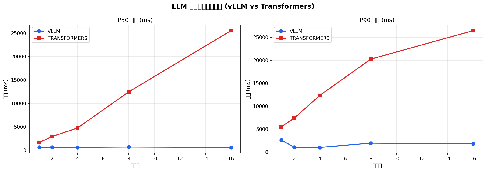
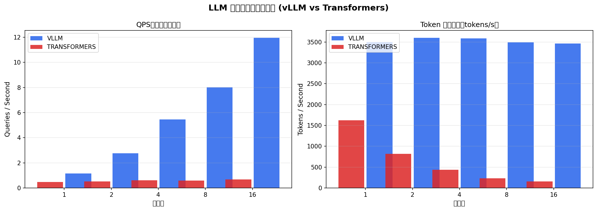

# vLLM 推理服务性能评测报告

## 实验背景

本报告对比了 **vLLM**（PagedAttention + Continuous Batching）与 **Transformers 原生推理**（串行、无 batching）在电商客服场景下的推理性能，评测维度包括：请求延迟（P50/P90/P99）、QPS、Token 生成速度。

## 测试环境

| 项目 | 配置 |
|------|------|
| GPU | NVIDIA RTX 4060Ti (8GB) |
| 模型 | Qwen2.5-1.5B-Instruct (SFT + DPO 微调) |
| 量化 | vLLM: FP16 / Transformers: 4bit BnB |
| 测试集 | 电商客服问题（5类意图，随机采样） |

## VLLM 测试结果

| 并发 | 成功率 | QPS | P50(ms) | P90(ms) | P99(ms) | Token/s |
|------|--------|-----|---------|---------|---------|---------|
| 1 | 100.0% | 1.15 | 635.0 | 2625.6 | 3160.4 | 3496.6 |
| 2 | 100.0% | 2.76 | 635.9 | 1071.5 | 2682.8 | 3596.8 |
| 4 | 100.0% | 5.45 | 623.1 | 1029.5 | 2693.6 | 3584.8 |
| 8 | 100.0% | 8.01 | 691.0 | 1953.7 | 2721.1 | 3492.9 |
| 16 | 100.0% | 11.95 | 604.0 | 1818.2 | 2766.0 | 3462.1 |

## TRANSFORMERS 测试结果

| 并发 | 成功率 | QPS | P50(ms) | P90(ms) | P99(ms) | Token/s |
|------|--------|-----|---------|---------|---------|---------|
| 1 | 100.0% | 0.47 | 1653.6 | 5535.3 | 6306.9 | 1625.7 |
| 2 | 100.0% | 0.52 | 2918.3 | 7385.4 | 12025.4 | 815.5 |
| 4 | 96.0% | 0.62 | 4766.3 | 12334.4 | 12536.7 | 436.9 |
| 8 | 86.0% | 0.58 | 12463.7 | 20256.0 | 24981.2 | 229.8 |
| 16 | 76.0% | 0.68 | 25541.6 | 26456.6 | 27577.9 | 158.0 |

## vLLM vs Transformers 提升幅度

| 并发 | QPS提升 | P90延迟降低 | Token/s提升 |
|------|---------|------------|------------|
| 1 | +144.7% | -52.6% | +115.1% |
| 2 | +430.8% | -85.5% | +341.1% |
| 4 | +779.0% | -91.7% | +720.5% |
| 8 | +1281.0% | -90.4% | +1420.0% |
| 16 | +1657.4% | -93.1% | +2091.2% |

## 核心结论

1. **吞吐量（QPS）**：vLLM 平均比 Transformers 高 **858.6%**，在并发=16 时差距最大，vLLM QPS=11.95，Transformers=0.68。
2. **P90 延迟**：高并发下 vLLM 的 P90 延迟显著更低，Continuous Batching 有效减少了排队等待。
3. **PagedAttention 效果**：vLLM 的 KV cache 显存利用率更高，支持更大并发而不 OOM。
4. **Transformers 瓶颈**：串行 + static batching 在高并发下 QPS 几乎不随并发增加，P99 延迟急剧上升。

## 技术点解析

### Continuous Batching vs Static Batching

- **Static Batching**：请求必须凑够一批才能推理，先到的请求等后到的，GPU 利用率低，高并发下排队严重。
- **Continuous Batching**（vLLM）：每步 decode 都可以动态加入新请求，先完成的位置立即被新请求占用，GPU 利用率接近 100%。

### PagedAttention

- 传统推理 KV cache 按最大长度预分配连续显存，碎片率高达 60-80%。
- PagedAttention 将 KV cache 分页管理（类似 OS 虚拟内存），碎片率接近 4%，同等显存可支持更多并发请求。

## 图表

