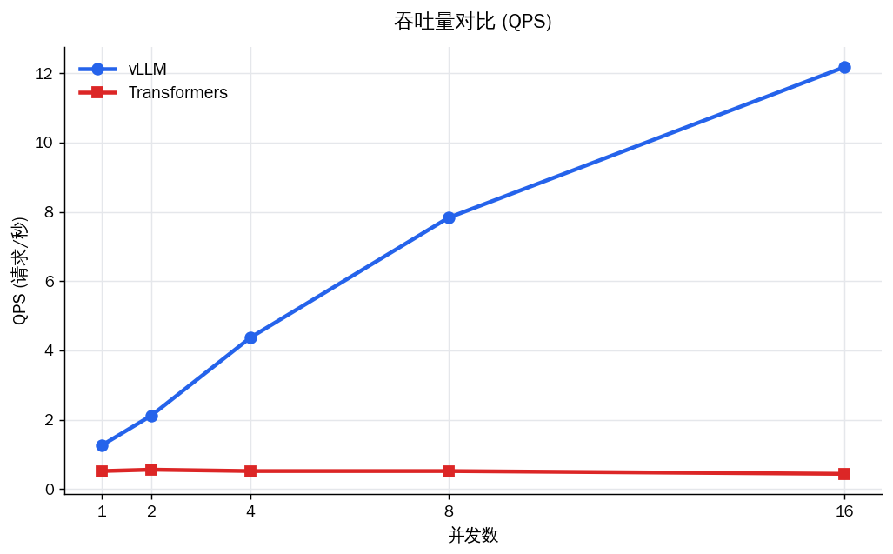
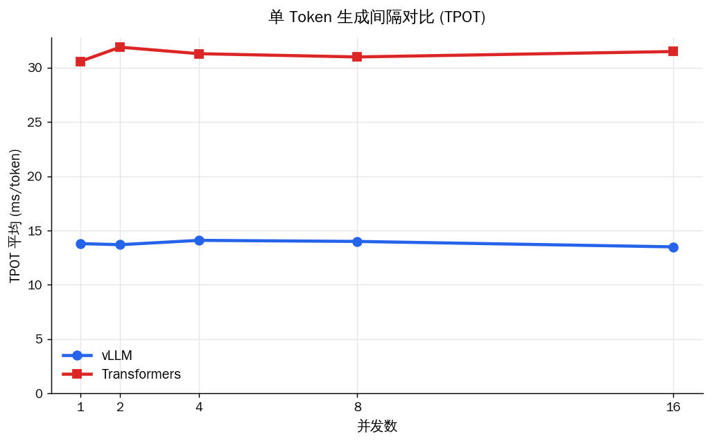

# 流式推理压测报告（TTFT / TPOT / QPS）

> 模型：`customer-service-llm` ｜ 每并发 50 请求，预热 5 次 ｜ max_tokens=256 ｜ 2026-06-03 17:58:15

指标说明：TTFT=首 token 延迟（响应快慢）；TPOT=每输出 token 平均间隔（吐字速度）；ITL=相邻 token 间隔；QPS=系统吞吐。

## 关键对比图

**TTFT_P90 对比（线性轴）**

**TTFT_P90 对比（对数轴）**

**QPS 对比**

**TPOT 对比**

## vLLM 明细

| 并发 | QPS | tok/s | TTFT_P50(ms) | TTFT_P90(ms) | TPOT_mean(ms) | ITL_P99(ms) | 成功率 |
|------|------|------|------|------|------|------|------|
| 1 | 1.26 | 70.6 | 29.7 | 31.3 | 13.8 | 31.8 | 100.0% |
| 2 | 2.12 | 141.4 | 40.6 | 41.5 | 13.7 | 27.0 | 100.0% |
| 4 | 4.37 | 260.5 | 41.2 | 44.7 | 14.1 | 28.4 | 100.0% |
| 8 | 7.83 | 503.0 | 42.1 | 43.0 | 14.0 | 18.1 | 100.0% |
| 16 | 12.18 | 743.2 | 40.9 | 53.3 | 13.5 | 21.4 | 100.0% |

## Transformers（对照组）明细

| 并发 | QPS | tok/s | TTFT_P50(ms) | TTFT_P90(ms) | TPOT_mean(ms) | ITL_P99(ms) | 成功率 |
|------|------|------|------|------|------|------|------|
| 1 | 0.52 | 32.6 | 56.4 | 57.5 | 30.6 | 112.5 | 100.0% |
| 2 | 0.56 | 31.1 | 1472.7 | 2309.8 | 31.9 | 120.2 | 100.0% |
| 4 | 0.52 | 31.5 | 4916.6 | 9161.5 | 31.3 | 103.0 | 100.0% |
| 8 | 0.52 | 31.8 | 12208.5 | 16098.8 | 31.0 | 121.2 | 100.0% |
| 16 | 0.44 | 31.1 | 31020.0 | 36310.2 | 31.5 | 155.6 | 100.0% |

## 核心结论

**1. TTFT（首 token 延迟）—— 差距随并发指数级拉大。** 并发=1 时两者接近（31.3ms vs 57.5ms），但并发=16 时 vLLM 仍仅 53.3ms，Transformers 飙至 36.3s，相差 **681 倍**。原因：Transformers 串行处理，第 N 个请求必须排队等前面所有请求**整段**生成完，排队时间全部计入 TTFT；vLLM 的 Continuous Batching 让新请求在下一个 decode step 即可加入当前批次，几乎无需排队。

**2. QPS（系统吞吐）—— 一个近线性扩展，一个完全卡死。** vLLM 从 1.26 扩展到 12.18（约 10×）；Transformers 全程卡在 ~0.52 QPS，加并发毫无收益——串行架构下系统吞吐恒等于单请求速度。并发=16 时 vLLM 吞吐为 Transformers 的 **28 倍**。

**3. TPOT（吐字速度）—— vLLM 始终快约 2.3 倍且与并发无关。** vLLM ~13.5ms/token，Transformers ~31.5ms/token，两者各自都不随并发变化：Transformers 因串行、任意时刻只有一个请求在 GPU 上，单流速度恒定；vLLM 的单 token 速度优势来自 FP16 + PagedAttention 的显存效率。

**4. 关于成功率与超时阈值。** 本轮两者成功率均 100%，因为压测超时阈值（默认 120s）高于 Transformers 最慢请求的 TTFT（约 36s）。但需指出：并发=16 时 Transformers 尾部请求要等 36 秒才出首字，对客服等实时场景已等同不可用——衡量服务质量应看 TTFT/SLA，而非单纯的请求完成率。
