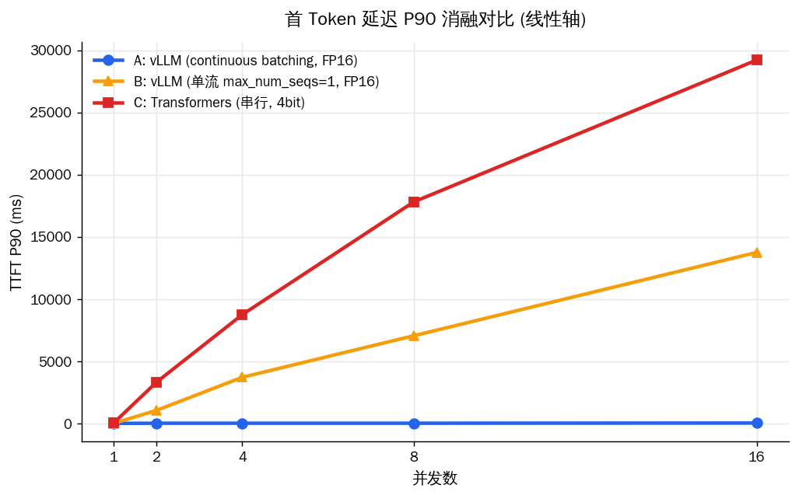

# 流式推理压测报告（消融版：隔离 continuous batching）

> 模型：`customer-service-llm` ｜ 每并发 50 请求，预热 5 次 ｜ max_tokens=256

## 实验设计（变量隔离）

| 组 | 框架 | batching | 精度 | 作用 |
|------|------|------|------|------|
| A | vLLM | 开 (max_num_seqs=256) | FP16 | 完整 vLLM |
| B | vLLM | 关 (max_num_seqs=1) | FP16 | 单流对照，仅去掉 batching |
| C | Transformers | 无 | 4bit | 朴素串行基线 |

- **A vs B**：唯一变量是 continuous batching（框架/精度/kernel 全同）→ 纯 batching 贡献。
- **B vs C**：都是单流无批处理，差距 = kernel 优化 + 量化开销（已和 batching 分离）。
- **A vs C**：端到端总差距，包含上述全部因素叠加，仅作总览、不单独归因。

## 关键对比图

**QPS 消融对比（核心图）**

**TTFT_P90 消融对比（线性轴）**

**TTFT_P90 消融对比（对数轴）**

**TPOT 消融对比**

## 核心结论

**0. Sanity check：并发=1 时 A≈B。** 并发=1 时 A 与 B 的 TTFT_P90 分别为 28.3ms / 28.1ms，QPS 为 1.22 / 1.25，两者接近——只有一个请求时 batching 开不开都没区别，验证了实验本身没有引入额外变量。

**1. 扩展性来自 continuous batching，而非框架本身（A vs B）。** 开启 batching 的 A，QPS 从 1.22 近线性扩展到 10.21（约 8×）；强制 max_num_seqs=1 退化为单流的 B，QPS 全程卡在 ~1.3，与朴素 Transformers（C，~0.59）一样毫无扩展。并发=16 时 A 的 TTFT_P90 仅 54.9ms，B 飙至 13.8s——**仅去掉 batching 这一个变量，TTFT 就相差 251×、QPS 相差 8×**。这是 continuous batching 价值的纯净证据：它消除了高并发下的排队，是吞吐扩展的根本来源。

**2. 单流下 vLLM 仍快于 Transformers，但这是 kernel + 量化，不是 batching（B vs C）。** 两者都无批处理，并发=16 时 B 的 TTFT_P90（13.8s）与 C（29.2s）的差距约 2.1×，TPOT 约 2.5×。这部分差距来自两点叠加且**未进一步隔离**：(a) C 开了 4bit，每层每 token 前向都要反量化，带来额外开销；(b) vLLM 推理专用的 fused kernel 比 Transformers 通用 generate 路径更高效。需要说明：单 token 速度（TPOT）由 kernel 与精度决定，**与 PagedAttention 无关**——PagedAttention 解决的是显存碎片、提升并发上限，影响的是吞吐而非单 token 延迟。

**3. 端到端总差距仅作总览（A vs C）。** 并发=16 时 A 对 C 的 TTFT_P90 相差 532×、QPS 相差 17×。这个数字同时包含 batching、kernel、量化三重因素，**不可单独归因于某一项**，因此本报告以 A vs B 的扩展性结论为主，此总差距仅作直观参考。

**4. 关于成功率与超时阈值。** 衡量高并发服务质量应看 TTFT/SLA，而非单纯的请求完成率：即便成功率 100%，B/C 在并发=16 时尾部请求要等数秒甚至数十秒才出首字，对客服等实时场景已等同不可用。（注：若 B 组在高并发出现超时，需确认压测 timeout 足够大且三组一致，否则数据不可比。）

## 各组明细

### A — vLLM (continuous batching, FP16)

| 并发 | QPS | tok/s | TTFT_P50(ms) | TTFT_P90(ms) | TPOT_mean(ms) | ITL_P99(ms) | 成功率 |
|------|------|------|------|------|------|------|------|
| 1 | 1.22 | 76.3 | 27.6 | 28.3 | 12.9 | 14.0 | 100.0% |
| 2 | 2.74 | 148.3 | 38.4 | 39.0 | 12.9 | 13.8 | 100.0% |
| 4 | 4.1 | 263.2 | 38.6 | 39.2 | 13.0 | 13.9 | 100.0% |
| 8 | 7.47 | 438.2 | 39.2 | 40.0 | 13.1 | 14.0 | 100.0% |
| 16 | 10.21 | 666.1 | 40.7 | 54.9 | 13.3 | 15.0 | 100.0% |

### B — vLLM (单流 max_num_seqs=1, FP16)

| 并发 | QPS | tok/s | TTFT_P50(ms) | TTFT_P90(ms) | TPOT_mean(ms) | ITL_P99(ms) | 成功率 |
|------|------|------|------|------|------|------|------|
| 1 | 1.25 | 78.4 | 27.5 | 28.1 | 12.5 | 14.2 | 100.0% |
| 2 | 1.37 | 78.8 | 692.0 | 1072.6 | 12.5 | 13.1 | 100.0% |
| 4 | 1.22 | 78.8 | 2149.7 | 3729.6 | 12.5 | 13.1 | 100.0% |
| 8 | 1.25 | 78.9 | 5387.5 | 7066.2 | 12.5 | 13.2 | 100.0% |
| 16 | 1.3 | 78.8 | 10896.7 | 13757.3 | 12.5 | 13.1 | 100.0% |

### C — Transformers (串行, 4bit)

| 并发 | QPS | tok/s | TTFT_P50(ms) | TTFT_P90(ms) | TPOT_mean(ms) | ITL_P99(ms) | 成功率 |
|------|------|------|------|------|------|------|------|
| 1 | 0.48 | 32.3 | 54.5 | 58.5 | 30.9 | 113.7 | 100.0% |
| 2 | 0.55 | 31.7 | 1464.9 | 3339.5 | 31.1 | 120.4 | 100.0% |
| 4 | 0.55 | 31.9 | 4789.1 | 8760.7 | 30.8 | 112.7 | 100.0% |
| 8 | 0.51 | 32.0 | 13174.2 | 17815.4 | 30.8 | 144.7 | 100.0% |
| 16 | 0.59 | 31.6 | 26729.4 | 29207.4 | 31.2 | 127.1 | 100.0% |
